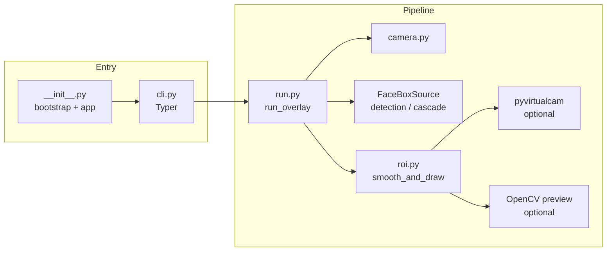

# Laughing Man — software architecture

This document describes the high-level structure of the **laughing-man** project: a Python CLI that reads a webcam, detects a face, composites a “Laughing Man” style overlay, optionally blurs the frame when no face is visible, and can mirror the result to a **virtual camera** (e.g. v4l2loopback on Linux) or an OpenCV preview window.

## Technology stack

| Layer | Role |
|--------|------|
| **Typer** | CLI (`main` command, options, validation). |
| **OpenCV** | Webcam capture, BGR frames, optional YuNet detector, preview window, compositing helpers. |
| **MediaPipe Tasks** | BlazeFace short/full-range TFLite models in **VIDEO** mode. |
| **Pillow (PIL)** | Overlay artwork, alpha compositing, pre-rotated overlay cache. |
| **pyvirtualcam** | Virtual webcam output (BGR), including Linux v4l2loopback. |
| **loguru** | Logging; configured from the CLI `--debug` flag. |

Bundled default artwork lives under `src/laughing_man/assets/` (`limg.png`, `ltext.png`). BlazeFace and YuNet model files are resolved and optionally downloaded under the XDG cache directory (see `model.py`).

## Repository layout

| Path | Purpose |
|------|---------|
| `src/laughing_man/` | Application package — all runtime code. |
| `src/laughing_man/assets/` | Default PNG overlay layers shipped with the wheel. |
| `docs/` | Design notes and proposals (e.g. `proposals/`). |
| `scripts/` | Standalone utilities (e.g. image prep), not part of the installed CLI. |
| `pyproject.toml` | Project metadata, dependencies, console script `laughing-man`. |

## Control flow (runtime)

1. **Entry** — `laughing_man:app` (see `[project.scripts]` in `pyproject.toml`) loads `laughing_man/__init__.py`, which calls `bootstrap.apply_runtime_env()` once (TensorFlow/OpenCV/Qt log noise, Linux Qt hints), then exposes the Typer `app` from `cli.py`.
2. **CLI** — `cli.main()` configures logging (`logging_setup.configure_logging`) and calls `run.run_overlay(...)` with parsed options.
3. **Orchestration** — `run.run_overlay()` opens the webcam (`camera.open_webcam`), loads overlay images (`overlay.load_overlay_images`), ensures detector models exist (`model.ensure_*`), builds a **FaceBoxSource** (BlazeFace or YuNet, optionally wrapped for cascade), starts a **background thread** to prefill the rotated overlay cache, then runs the **capture loop**: read frame → `face_source.face_box(...)` → `roi.smooth_and_draw(...)` → optional `pyvirtualcam` send and/or OpenCV preview.

## Module map (`src/laughing_man/`)

Use this table to find responsibilities and jump to the right file.

| Module | Responsibility |
|--------|----------------|
| **`__init__.py`** | Applies `bootstrap` before other imports; exports Typer `app`. |
| **`bootstrap.py`** | Process environment defaults (`TF_CPP_MIN_LOG_LEVEL`, Qt on Linux, etc.). |
| **`cli.py`** | Typer application: flags for detector, ROI tuning, virtual camera, overlay image, `--debug`. |
| **`run.py`** | Main orchestration: webcam, model setup, overlay cache prefill thread, capture loop, virtual camera lifecycle. |
| **`constants.py`** | Tunables: camera index, detection thresholds, ROI/overlay factors, key codes for tuning, default lambdas. |
| **`protocols.py`** | Structural typing: `FaceBoxSource` (raw `(x,y,w,h)` per frame), `PrivacyEffect` (full-frame effect when privacy engages). |
| **`deps.py`** | `PipelineDeps` — injectable implementations (e.g. privacy backend) for a run. |
| **`camera.py`** | `open_webcam` and user-facing error messages when capture fails. |
| **`model.py`** | BlazeFace / YuNet path resolution, cache dir, optional HTTP download. |
| **`detection.py`** | BlazeFace: `FaceDetectorOptions`, `mediapipe_detect_face`, `BlazeFaceFaceBoxSource`. |
| **`yunet_face.py`** | OpenCV `FaceDetectorYN` (YuNet): `create_yunet_detector`, `YuNetFaceBoxSource`. |
| **`cascade.py`** | `CascadedFaceBoxSource` — expands the previous smoothed ROI and runs the inner detector on a crop first (YuNet-oriented); crop/box math helpers. |
| **`roi.py`** | `RoiState`, temporal smoothing (**EMA**, **Kalman**, **Kalman + optical flow**), compositing the square overlay onto the face ROI, privacy debounce and `PrivacyEffect` application. |
| **`box_tracking.py`** | `BoxKalman` (OpenCV Kalman on center/size) and optical-flow helper used by Kalman-flow ROI mode. |
| **`overlay.py`** | Load bundled or custom overlay images; `build_rotated_overlay_frame`; square resize for the cache. |
| **`privacy.py`** | `GaussianBlurPrivacy` — full-frame blur blended by strength. |
| **`tuning.py`** | Interactive adjustment of `roi_lambda` / `size_lambda` via OpenCV keys or stdin (when TTY available). |
| **`logging_setup.py`** | Single stderr sink for loguru; level from `--debug`. |

**Face detection is intentionally pluggable:** anything implementing `FaceBoxSource` can supply `(x, y, w, h)` or `None`. BlazeFace uses MediaPipe VIDEO timestamps; YuNet ignores timestamps; cascade wraps another `FaceBoxSource` and uses shared `RoiState` from `smooth_and_draw`.

## Data flow (one frame)

1. **Input** — BGR `numpy` array from `VideoCapture.read()`.
2. **Detection** — Selected backend returns the largest face box above minimum size (see `constants.MIN_FACE_SIZE`), or `None`.
3. **Stabilization** — `roi.smooth_and_draw` updates `RoiState` using the chosen motion model, applies optional EMA on center/size, and composites the **pre-sized** RGB overlay and mask onto the face region.
4. **Privacy** — After a streak of no-face frames, the pipeline increases blur via `PipelineDeps.privacy` (`GaussianBlurPrivacy` by default).
5. **Output** — The same BGR frame is sent to the virtual camera (if enabled) and/or shown in a named OpenCV window; the rotating overlay angle advances each frame for the stock two-layer artwork.

## External dependencies (conceptual)

- **Webcam** — System video device (index from `constants.CAMERA_INDEX`, typically `0`).
- **Virtual camera** — OS-specific: on Linux, **v4l2loopback** provides a `/dev/video*` sink that `pyvirtualcam` writes to; see `README.md` for `modprobe` examples.
- **Models** — BlazeFace TFLite (short vs full range) and YuNet ONNX URLs/paths are centralized in `constants.py` / `model.py`; overrides via environment variables where documented in code.

## Related documentation

- **`README.md`** — Install, run, virtual webcam setup.
- **`docs/proposals/`** — Exploratory design write-ups (not necessarily implemented).

## Extension points (for contributors)

- **New detector** — Implement `FaceBoxSource` in a new module and wire it in `run.py` similarly to `BlazeFaceFaceBoxSource` / `YuNetFaceBoxSource`.
- **New privacy effect** — Implement `PrivacyEffect` and pass it in `PipelineDeps` (today `run.py` constructs `GaussianBlurPrivacy()` directly; wiring could be generalized if needed).
- **ROI behavior** — `roi.smooth_and_draw` and `RoiState` encapsulate motion models; `box_tracking.py` holds Kalman/optical-flow primitives.
